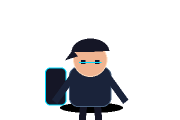
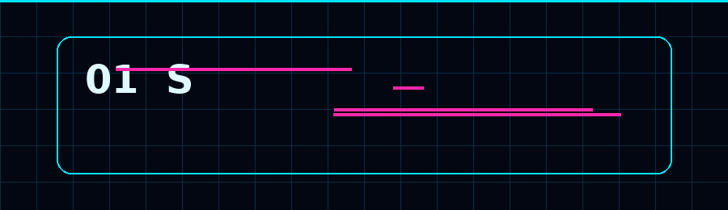
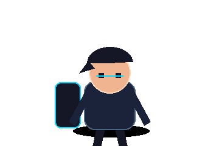
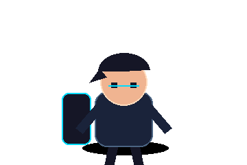
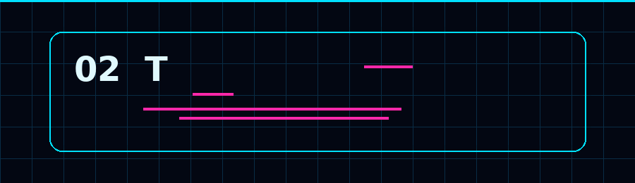
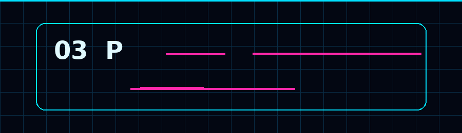
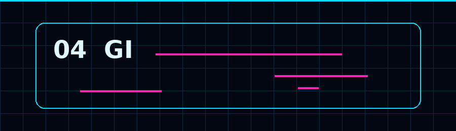
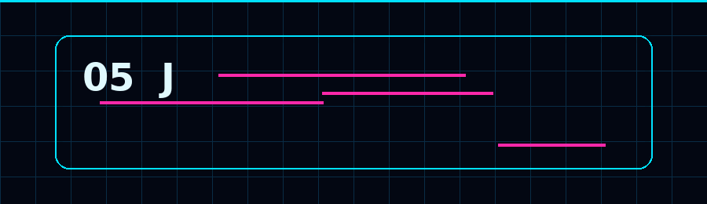
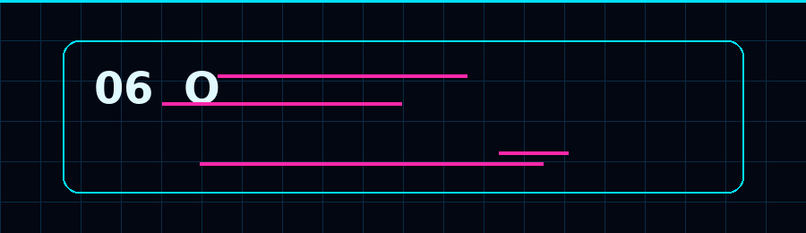

<div align="center">

# `RHUSHI HEBBAR`



### `A 2D CHARACTER IS GUIDING YOU THROUGH THIS README.`

</div>

---

## 🎬 THE STORY

**The README is no longer a document. It is a short animated journey.**

```text
00:00 ── BOOT
00:02 ── CHARACTER ENTERS
00:04 ── NAME GLITCH REVEAL
00:06 ── IDENTITY
00:12 ── TECH STACK
00:18 ── PROJECTS
00:24 ── GITHUB TELEMETRY
00:28 ── JOURNEY
00:32 ── CONNECT
00:36 ── FINAL TRANSMISSION
```



## `01 / IDENTITY`

<div align="center"></div>

> **I build digital experiences where software, design and experimentation meet.**

I'm an MCA student and developer exploring **web applications, AI, cloud, data, automation and immersive interfaces**.

---

<div align="center"></div>



## `02 / TECH STACK`

<div align="center">

<br><br>

</div>

---

<div align="center"></div>



## `03 / PROJECT MATRIX`

| PROJECT | WHAT IT DOES |
|---|---|
| **Resume Analyzer** | Resume extraction, skill analysis, matching and AI-assisted generation |
| **Semaphore / Aqua Saga** | Immersive event platform with an underwater visual identity |
| **Billing / ERP** | Product, customer, supplier and billing workflows |
| **WESAD ECG ML** | ECG features with machine-learning and LOSO evaluation |

---



## `04 / GITHUB TELEMETRY`

<div align="center">


</div>

---

<div align="center"></div>



## `05 / JOURNEY`

```text
BCA
 │
 ├── Web Development
 ├── Python / Flask
 ├── Cloud / BigQuery
 ├── AI / ML experiments
 │
 ▼
MCA
 │
 └── More systems. More experiments. More things to build.
```

---



## `06 / OPEN CHANNEL`

<div align="center">

[](https://github.com/rhushihebbar07)
[](https://www.linkedin.com/)

### `GOOD IDEAS ARE BETTER WHEN THEY ARE BUILT.`


```text
[ CONNECTION CLOSING... ]

Same human.
Higher version loading...

> END OF TRANSMISSION_
```

</div>
