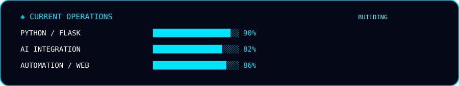

<!-- RHUSHI HEBBAR // FUTURE NODE -->
<p align="center">
  
</p>

<p align="center">
  
</p>

<p align="center">
  
</p>


<h3 align="center">MCA Student | Python & Flask Developer | AI Integration | Automation | Creative Technology</h3>

<p align="center">
  
</p>

> [!NOTE]
> <code>➜ 🎓 Pursuing <b>MCA</b></code><br><br>
> <code>➜ 🐍 Building with <b>Python + Flask + SQLite</b></code><br><br>
> <code>➜ 🤖 Exploring <b>AI integration and automation</b></code><br><br>
> <code>➜ 🌐 Creating <b>web applications and digital systems</b></code><br><br>
> <code>➜ 🎨 Interested in <b>graphic design, UI/UX and creative technology</b></code><br><br>
> <code>➜ 🚀 Learning, experimenting and shipping projects</code>


<h2>⌨️ Developer Terminal</h2>

```bash
┌──(rhushi㉿github)-[~/future-node]
└─$ whoami

rhushi_hebbar

┌──(rhushi㉿github)-[~/future-node]
└─$ cat profile.txt

NAME       : Rhushi Hebbar
EDUCATION  : MCA
ROLE       : Developer / Creative Technologist
CORE       : Python / Flask
AI         : ACTIVE
AUTOMATION : ENABLED
STATUS     : ONLINE

┌──(rhushi㉿github)-[~/future-node]
└─$ ./mission.sh

Build intelligent systems.
Automate repetitive workflows.
Create useful interfaces.
Keep learning.

[████████████████████████████████████] 100%

SYSTEM READY // AWAITING NEXT BUILD
```

<h2>◈ CONTROL PANEL</h2>

```text
╭──────────────────────────────────────────────────────────────╮
│                    RH // CONTROL PANEL                       │
├──────────────────────────────────────────────────────────────┤
│                                                              │
│   🧠 AI              ● ACTIVE       → AI / AUTOMATION        │
│   🌐 WEB             ● ONLINE       → WEB DEVELOPMENT        │
│   ⚙️ AUTOMATION      ● ENABLED     → WORKFLOW SYSTEMS       │
│   🎨 CREATIVE        ● ONLINE       → DESIGN / 3D            │
│   🚀 PROJECTS        ● BUILDING     → PROJECT ARCHIVE        │
│   📡 GITHUB          ● LIVE         → TELEMETRY              │
│                                                              │
╰──────────────────────────────────────────────────────────────╯
```

<h2>◈ 01 // IDENTITY CORE</h2>

```text
┌───────────────────────────────────────────────────────────────┐
│                       IDENTITY CORE                            │
├───────────────────────────────────────────────────────────────┤
│                                                               │
│  OPERATOR       : RHUSHI HEBBAR                               │
│  ROLE           : MCA STUDENT / DEVELOPER                     │
│  REGION         : INDIA 🇮🇳                                    │
│  PRIMARY DOMAIN  : SOFTWARE + CREATIVE TECHNOLOGY              │
│  STATUS         : BUILDING 🚀                                  │
│                                                               │
│  SPECIALIZATION :                                              │
│      WEB DEVELOPMENT     ████████████████████░░  ACTIVE        │
│      AI INTEGRATION     ██████████████████░░░░  ACTIVE        │
│      AUTOMATION         ███████████████████░░░  ACTIVE        │
│      UI / UX            █████████████████░░░░░  ACTIVE        │
│      CREATIVE TECH      ████████████████░░░░░░  ACTIVE        │
│                                                               │
└───────────────────────────────────────────────────────────────┘
```

<details>
<summary><b>▸ DECODE IDENTITY</b></summary>

```python
class RhushiHebbar:

    role = "Developer + Creative Technologist"
    education = "MCA"

    interests = [
        "Web Development",
        "Artificial Intelligence",
        "Automation",
        "UI/UX",
        "Graphic Design",
        "Photography"
    ]

    primary_stack = [
        "Python",
        "Flask",
        "JavaScript",
        "SQL"
    ]

    mission = "Build the future, one system at a time."
```

</details>

<h2>◈ 02 // TECHNOLOGY MATRIX</h2>

<h3 align="center">PROGRAMMING / WEB</h3>
<p align="center">

</p>

<h3 align="center">ENGINEERING / TOOLS</h3>
<p align="center">

</p>

<h3 align="center">CLOUD / DEPLOYMENT</h3>
<p align="center">

</p>

<h3 align="center">CREATIVE</h3>
<p align="center">

</p>

<h2>◈ 03 // SYSTEM ARCHITECTURE</h2>

```text
╭─────────────────────────────────────────────────────────────╮
│                    RH // SYSTEM FLOW                        │
├─────────────────────────────────────────────────────────────┤
│                                                             │
│  USER / IDEA                                                │
│       │                                                     │
│       ▼                                                     │
│  ┌───────────────┐      ┌────────────────────┐              │
│  │ WEB INTERFACE │ ───► │ PYTHON / FLASK     │              │
│  └───────────────┘      └─────────┬──────────┘              │
│                                   │                         │
│                     ┌─────────────┼─────────────┐           │
│                     ▼             ▼             ▼           │
│                  SQLITE          AI API       AUTOMATION    │
│                     │             │             │           │
│                     └─────────────┼─────────────┘           │
│                                   ▼                         │
│                     DOCUMENT / RESPONSE / SYSTEM            │
│                                   │                         │
│                                   ▼                         │
│                           DEPLOY / DELIVER                   │
│                                                             │
╰─────────────────────────────────────────────────────────────╯
```

<h2>◈ 04 // AI + AUTOMATION</h2>

<p align="center">

</p>

```text
                 ┌─────────────────────────┐
                 │       AI ENGINE          │
                 ├─────────────────────────┤
                 │ AI APIs                  │
                 │ Python Logic             │
                 │ Data Extraction          │
                 │ Document Processing      │
                 │ Automation Rules         │
                 └───────────┬─────────────┘
                             ▼
                 ┌─────────────────────────┐
                 │ ACTION / RESPONSE       │
                 │ DOCUMENT / WORKFLOW     │
                 └─────────────────────────┘
```

<h2>◈ 05 // FEATURED BUILD</h2>

<p align="center">

</p>

<h3>🎓 COLLEGE PROJECT APPROVAL & CERTIFICATE ENGINE</h3>

<p>
A Flask-based system where students submit GitHub project links for review,
faculty/admin users verify submissions, and approved projects can produce
PDF certificates with automated delivery.
</p>

<p>
<a href="https://github.com/rhushihebbar07/certificate-genrater">

</a>
</p>

```text
STUDENT
   │
   ▼
GITHUB PROJECT SUBMISSION
   │
   ▼
AUTHENTICATION / VERIFICATION
   │
   ▼
FACULTY / ADMIN REVIEW
   │
   ├───────────────┐
   │               │
   ▼               ▼
APPROVED         REJECTED
   │
   ▼
AI / PDF ENGINE
   │
   ▼
CERTIFICATE
   │
   ▼
SMTP DELIVERY
```

<h3>MODULE STATUS</h3>

| MODULE | STATUS |
|---|---|
| 🔐 Authentication | `ONLINE` |
| 🔗 GitHub Submission | `ONLINE` |
| 👨‍🏫 Review Workflow | `ONLINE` |
| 🤖 AI Integration | `ACTIVE` |
| 📄 PDF Generation | `ACTIVE` |
| 📧 SMTP Delivery | `ACTIVE` |
| 🗄️ SQLite | `ONLINE` |
| 🎨 Responsive UI | `ACTIVE` |

<h2>◈ 06 // PROJECT ARCHIVE</h2>

<details>
<summary>🚀 EXPAND PROJECT DATABASE</summary>

<br>

### `P-001 // RESUME ANALYZER`

```text
TYPE   : AI WEB APPLICATION
STACK  : Python / Flask / SQLite / AI
STATUS : DEVELOPMENT
```

Resume upload, text extraction, skill analysis, qualification analysis,
job matching and AI-assisted resume generation.

---

### `P-002 // BILLING / ERP SYSTEM`

```text
TYPE   : DESKTOP APPLICATION
STACK  : Python / PySide6 / SQLite
STATUS : DEVELOPMENT
```

Billing, products, categories, units, customers, suppliers and
GST-oriented business workflows.

---

### `P-003 // SEMAPHORE // AQUA SAGA`

```text
TYPE   : 3D EVENT EXPERIENCE
STACK  : React / Vite / Three.js / GSAP
STATUS : ACTIVE
```

Immersive underwater event experience with animated 3D environments,
responsive interfaces and aquatic visual design.

---

### `P-004 // WESAD ECG AI`

```text
TYPE   : MACHINE LEARNING / RESEARCH
STACK  : Python / Random Forest / SVM / XGBoost
STATUS : RESEARCH
```

ECG feature extraction with Leave-One-Subject-Out evaluation and
subject-wise model analysis.

</details>

<h2>◈ 07 // GITHUB TELEMETRY</h2>

<p align="center">


<br><br>

</p>

<h2>◈ 08 // LIVE ACTIVITY STREAM</h2>

<p align="center">

</p>

<h2>◈ 09 // ACHIEVEMENT DATABASE</h2>

<p align="center">

</p>

<h2>◈ 10 // CONTRIBUTION MATRIX</h2>

<p align="center">

</p>

<h2>◈ 11 // INTERACTIVE TERMINAL</h2>

<details>
<summary>💻 OPEN TERMINAL SESSION</summary>

<br>

```text
╭──────────────────────────────────────────────────────────────╮
│ RHUSHI@FUTURE-NODE :: TERMINAL                              │
├──────────────────────────────────────────────────────────────┤
│                                                              │
│ $ whoami                                                     │
│ rhushi_hebbar                                                │
│                                                              │
│ $ profile.role                                               │
│ MCA Student / Developer / Creative Technologist              │
│                                                              │
│ $ system.status                                              │
│ ONLINE 🟢                                                     │
│                                                              │
│ $ system.core                                                │
│ PYTHON / FLASK                                               │
│                                                              │
│ $ system.ai                                                  │
│ ACTIVE 🤖                                                     │
│                                                              │
│ $ system.automation                                          │
│ ENABLED ⚡                                                    │
│                                                              │
│ $ mission                                                    │
│ Build intelligent systems.                                   │
│ Automate repetitive workflows.                               │
│ Create beautiful interfaces.                                 │
│ Keep learning.                                               │
│                                                              │
│ $ ./future.sh                                                │
│ [████████████████████████████████████████] 100%              │
│                                                              │
│ SYSTEM READY // AWAITING NEXT BUILD                          │
│                                                              │
╰──────────────────────────────────────────────────────────────╯
```

</details>

<h2>◈ 12 // SYSTEM LOG</h2>

<p align="center">

</p>

<h2>◈ 13 // CREATIVE STACK</h2>

<p align="center">

```text
╔══════════════════════════════════════════════════════════╗
║                  CREATIVE ENGINE                         ║
╠══════════════════════════════════════════════════════════╣
║                                                          ║
║  📷 PHOTOGRAPHY                                           ║
║  🎨 GRAPHIC DESIGN                                        ║
║  🖥️ UI / UX                                               ║
║  🎬 VISUAL CONTENT                                        ║
║  🌊 3D / IMMERSIVE EXPERIENCES                            ║
║                                                          ║
╚══════════════════════════════════════════════════════════╝
```

</p>

<h2>◈ 14 // CONNECTIVITY</h2>

<p align="center">

<a href="mailto:rhushihebbar22@gmail.com">

</a>

<a href="https://linkedin.com/in/rhushihebbar07">

</a>

<a href="https://github.com/rhushihebbar07">

</a>

<a href="https://discord.com/users/rhushihebbar07">

</a>

</p>

<h2>◈ 15 // FINAL TRANSMISSION</h2>

<p align="center">

</p>

<p align="center">
  <code>BUILD • AUTOMATE • CREATE • REPEAT</code>
</p>
