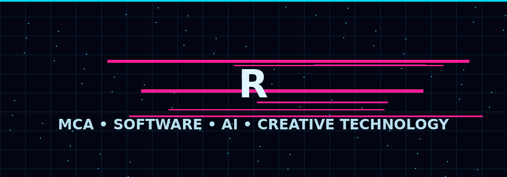
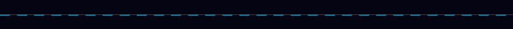
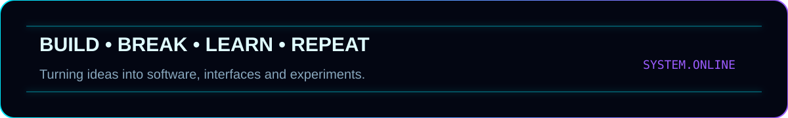

<div align="center">





# `RHUSHI HEBBAR`

### `MCA • SOFTWARE DEVELOPER • AI EXPLORER • CREATIVE TECHNOLOGIST`

[](https://github.com/rhushihebbar07)
[](https://github.com/rhushihebbar07)
[](https://www.linkedin.com/)

</div>

---

<div align="center">

</div>

## `01 / SYSTEM IDENTITY`

> **I build digital experiences where software, design and experimentation meet.**

I'm an MCA student and developer interested in **web applications, AI, cloud platforms, automation, data and immersive interfaces**.

I enjoy taking an idea from a rough concept → working prototype → polished experience.

```text
┌──────────────────────────────────────────────────────────────┐
│  CURRENT MODE                                                │
│                                                              │
│  LEARNING      ████████████████████░░  92%                  │
│  BUILDING      █████████████████████░  96%                  │
│  EXPERIMENTING ██████████████████░░░░  88%                  │
│  SHIPPING      █████████████████░░░░░  84%                  │
└──────────────────────────────────────────────────────────────┘
```


## `02 / TECH STACK`

<div align="center">

### LANGUAGES


### FRAMEWORKS & DEVELOPMENT


### DATA / CLOUD / TOOLS


</div>


## `03 / WHAT I BUILD`

| AREA | FOCUS |
|---|---|
| `WEB` | Responsive interfaces, dashboards, portals and full-stack applications |
| `AI` | AI-assisted applications, NLP, document processing and experimentation |
| `DATA` | Data processing, BigQuery and machine-learning workflows |
| `CLOUD` | Google Cloud, deployment workflows and cloud-native experiments |
| `CREATIVE` | UI/UX, visual design, photography and interactive experiences |

---

## `04 / SELECTED PROJECTS`

### ◈ Resume Analyzer & Generator
A Flask-based platform for resume extraction, skill analysis, job matching and AI-assisted resume generation.

**Stack:** `Python` `Flask` `SQLite` `spaCy` `OpenAI`

### ◈ Semaphore / Aqua Saga
An immersive event experience combining a responsive event platform with an underwater visual identity.

**Stack:** `React` `Vite` `Three.js` `GSAP` `Supabase`

### ◈ Billing / ERP System
A desktop-oriented billing and business-management system with product, category, unit, customer and supplier workflows.

**Stack:** `Python` `PySide6` `SQLite`

### ◈ ECG / WESAD ML Research
A machine-learning workflow exploring ECG statistical features and Leave-One-Subject-Out evaluation.

**Stack:** `Python` `Random Forest` `SVM` `XGBoost`


## `05 / GITHUB TELEMETRY`

<div align="center">


</div>

<div align="center">


</div>


## `06 / CURRENTLY EXPLORING`

```text
AI SYSTEMS       ███████████████████░░
CLOUD            ██████████████████░░░
FULL STACK       ████████████████████░
3D / WEBGL       ███████████████░░░░░░
SYSTEM DESIGN    █████████████████░░░░
```

- Building production-style web applications
- Exploring AI-powered developer workflows
- Improving cloud and data engineering skills
- Designing interfaces that feel alive rather than static

---

## `07 / CONNECT`

<div align="center">

**Have an idea worth building?**

[](https://github.com/rhushihebbar07)
[](https://www.linkedin.com/)

</div>

---

<div align="center">

```text
╔══════════════════════════════════════════════════════════╗
║                                                          ║
║        CODE IS THE MEDIUM. IDEAS ARE THE SIGNAL.        ║
║                                                          ║
╚══════════════════════════════════════════════════════════╝
```

### `RHUSHI HEBBAR // END OF TRANSMISSION`


</div>
