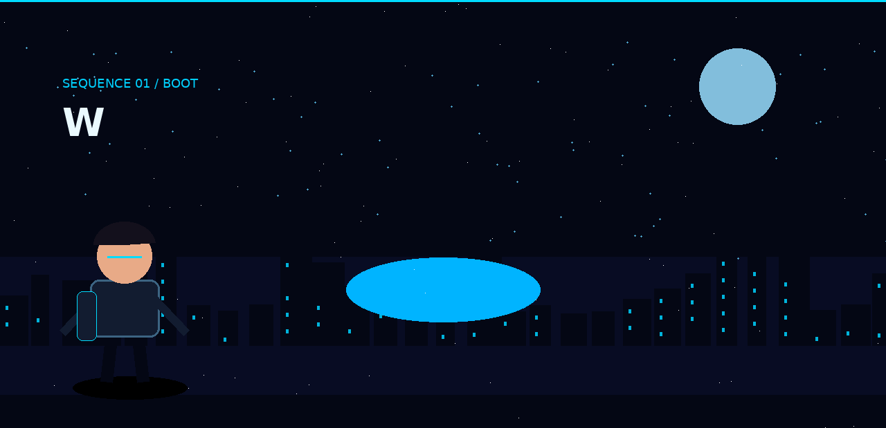
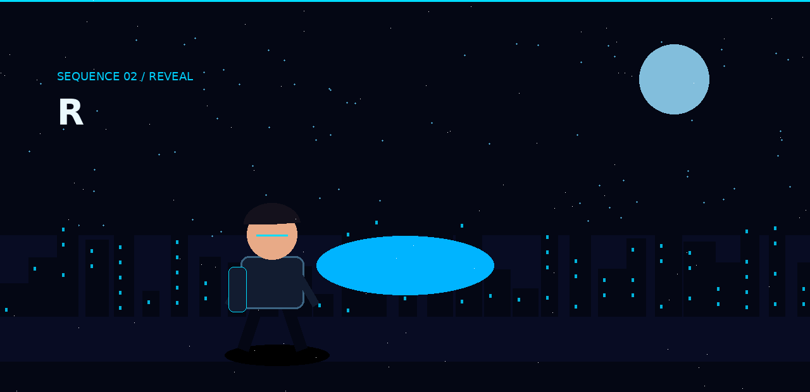
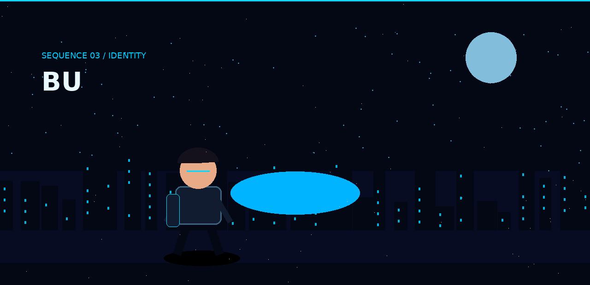
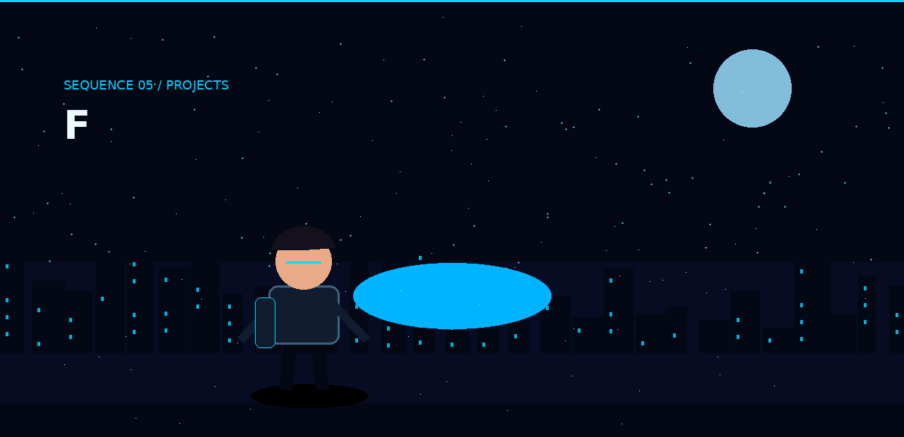
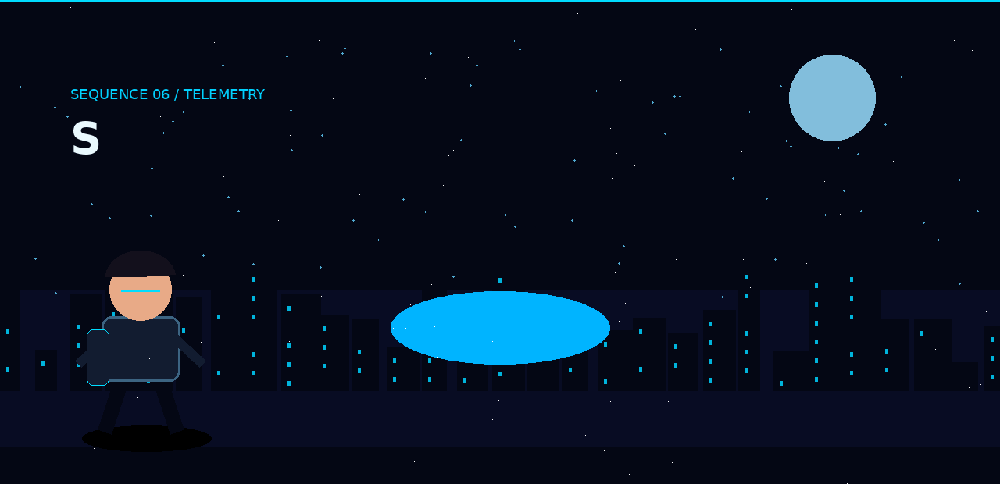
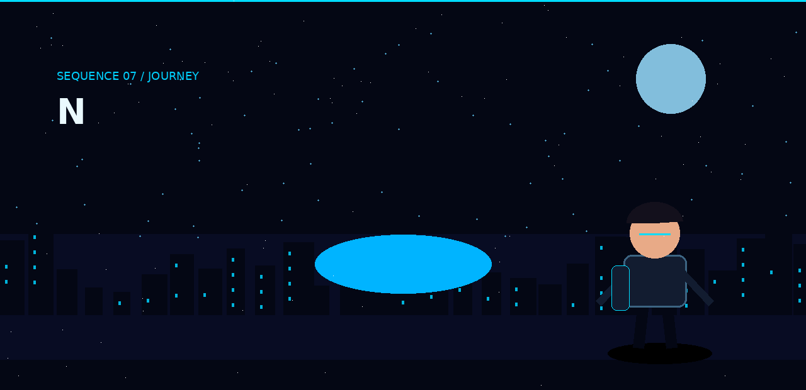
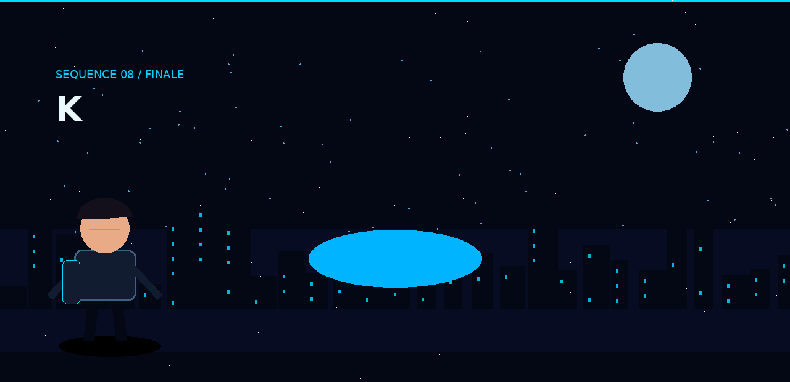

<div align="center">

# `RHUSHI HEBBAR`

### `A CINEMATIC GITHUB PROFILE`



</div>

---

# `THE EXPERIENCE`

This profile is designed like a **short cinematic sequence** rather than a conventional README.

**Scroll → scene → character → reveal → next scene.**

> GitHub does not expose page-scroll events to Markdown, so the cinematic effect is achieved with full-width animated film scenes that autoplay as you move through the profile.

---

<div align="center">

</div>

## `01 / WHO IS RHUSHI?`

I'm an **MCA student and developer** interested in building software where engineering, AI, data, cloud and visual design meet.

```text
ROLE
  ├── Software Developer
  ├── AI / ML Explorer
  ├── Cloud & Data Learner
  └── Creative Technologist
```

---

<div align="center">

</div>

## `02 / THE IDEA`

> **Don't just build something that works. Build something people remember.**

My projects usually start as an experiment and evolve into a complete system, interface or visual experience.

---

<div align="center">

</div>

## `03 / THE TOOLKIT`

<div align="center">


<br><br>


</div>

---

<div align="center">

</div>

## `04 / THE PROJECTS`

| PROJECT | STORY |
|---|---|
| **Resume Analyzer** | AI-assisted resume extraction, analysis, matching and generation |
| **Semaphore / Aqua Saga** | Immersive event platform with a cinematic underwater identity |
| **Billing / ERP** | Desktop business workflows for products, customers and suppliers |
| **WESAD ECG ML** | ECG feature extraction and machine-learning experiments |

---

<div align="center">

</div>

## `05 / THE SIGNAL`

<div align="center">


</div>

---

<div align="center">

</div>

## `06 / THE JOURNEY`

```text
BCA
 │
 ├── Web Development
 ├── Python / Flask
 ├── Cloud / BigQuery
 ├── AI / ML
 │
 ▼
MCA
 │
 └── THE NEXT CHAPTER
       ↓
     BUILD MORE
       ↓
     LEARN MORE
```

---

<div align="center">


### `END OF TRANSMISSION`

**The story isn't finished.**

[](https://github.com/rhushihebbar07)
[](https://www.linkedin.com/)

```text
> SYSTEM STATUS: BUILDING
> NEXT FRAME: UNKNOWN
> MODE: KEEP EXPLORING_
```

</div>
