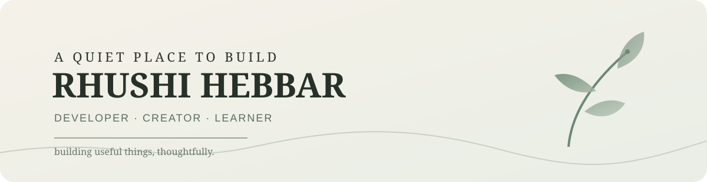

<div align="center">



<br><br>

# Rhushi Hebbar

### Developer · Creator · Learner

*Building useful things, thoughtfully.*

<br>

[](https://github.com/rhushihebbar07)
[](https://www.linkedin.com/)
[](mailto:rhushihebbar07@gmail.com)

</div>

---

## About

I'm an **MCA student at Nitte, Mangalore**, interested in building practical software and thoughtful digital experiences.

I enjoy working across **web development, AI, data, cloud technologies and visual design**. My approach is simple: understand the problem, keep the experience clear, and build something useful.

> **Good software doesn't need to shout. It just needs to work well.**

---

## Selected Work

### 01 — Resume Analyzer

A Flask application that reads PDF resumes, extracts useful information, analyzes skills and qualifications, suggests suitable roles, and supports AI-assisted resume generation.

`Python` `Flask` `SQLite` `spaCy` `OpenAI API`

---

### 02 — Semaphore · Aqua Saga

A responsive event experience built around an underwater visual identity, combining event information with immersive motion and interactive UI.

`React` `Vite` `Three.js` `GSAP` `Supabase`

---

### 03 — WESAD ECG AI

A machine-learning experiment using ECG features from the WESAD dataset with **Leave-One-Subject-Out** evaluation.

`Python` `Random Forest` `SVM` `XGBoost`

---

### 04 — Billing / ERP

A desktop software concept for billing and business management with products, categories, units, customers, suppliers and GST-oriented data.

`Python` `PySide6` `SQLite`

---

## Tools I Work With

<div align="center">


</div>

<br>

| Area | Tools |
|---|---|
| **Languages** | Python · JavaScript · HTML · CSS · SQL |
| **Web** | React · Vite · Flask · SQLAlchemy |
| **Data / AI** | spaCy · BigQuery · Machine Learning · PDF processing |
| **Cloud** | Google Cloud · Supabase |
| **Tools** | Git · GitHub · VS Code · Docker · Figma |

---

## Currently

```text
learning        AI · Cloud · Data · Full Stack
building        practical software & web experiences
exploring       better UI, automation & 3D interaction
growing         projects that solve real problems
```

---

## A Little More

- 🎓 MCA — Nitte, Mangalore
- 🧩 Interested in full-stack development
- ☁️ Exploring Google Cloud and BigQuery
- 🤖 Experimenting with AI and machine learning
- 🎨 Interested in photography, design and creative technology
- 🌱 Always learning something new

---

## GitHub

<div align="center">


</div>

<br>

<div align="center">


</div>

---

## Contribution Trail

<div align="center">


</div>

---

<div align="center">


<br>

**Code with clarity. Create with intention.**

<br>

`quiet craft / rhushi hebbar`

</div>
