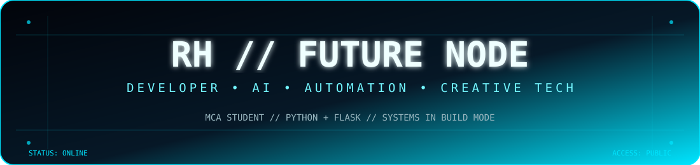

<div align="center">



<br/>

<a href="https://github.com/rhushihebbar07">
  
</a>
<a href="https://www.linkedin.com/">
  
</a>
<a href="mailto:rhushihebbar07@gmail.com">
  
</a>

<br/><br/>


</div>

---

## 👋 Hey, I'm Rhushi

I'm an **MCA student at Nitte, Mangalore** and a developer who enjoys turning ideas into useful digital products.

My work sits at the intersection of **web development, UI/UX, automation, data, cloud technologies, and creative design**. I like building projects that are not only functional, but also visually polished and easy to use.

```text
╭────────────────────────────────────────────────────────────╮
│  RHUSHI HEBBAR                                             │
│                                                            │
│  🎓 MCA Student @ Nitte, Mangalore                         │
│  💻 Full-Stack / Python / React Developer                  │
│  ☁️  Cloud & Data Explorer                                │
│  🎨 UI / Graphic / Creative Technology                     │
│  🚀 Building products, experimenting, learning             │
╰────────────────────────────────────────────────────────────╯
```

### ⚡ Currently

- 🎓 Pursuing **Master of Computer Applications (MCA)**
- 🌊 Building interactive experiences for **Semaphore / Aqua Saga**
- 🧠 Exploring **AI, data analytics, cloud & automation**
- ☁️ Learning through **Google Cloud / BigQuery** projects
- 🛠️ Developing practical software instead of just tutorials
- 🚀 Growing **Yukthi Technologies** as a software/technology brand

---

## 🧩 What I Build

<table>
<tr>
<td width="50%" valign="top">

### 🌐 Web Applications
- React + Vite interfaces
- Flask applications
- Responsive dashboards
- Authentication & role-based systems
- Supabase-backed applications
- GitHub Pages deployments

</td>
<td width="50%" valign="top">

### 🤖 AI & Data
- Resume analysis
- AI-assisted resume generation
- NLP / text extraction
- ECG classification experiments
- BigQuery analytics
- Machine-learning evaluation

</td>
</tr>
<tr>
<td width="50%" valign="top">

### 🎨 Creative Technology
- 3D event websites
- Interactive landing pages
- Motion-driven UI
- Graphic design
- Photography
- Live-streaming setups

</td>
<td width="50%" valign="top">

### ☁️ Cloud & Dev Tools
- Google Cloud
- BigQuery
- Git & GitHub
- Docker
- REST APIs
- Deployment & CI/CD workflows

</td>
</tr>
</table>

---

## 🛠️ Tech Stack

<div align="center">


</div>

<br/>

<div align="center">

**Languages**  
`Python` `JavaScript` `HTML` `CSS` `SQL`

**Frameworks / Libraries**  
`React` `Vite` `Flask` `SQLAlchemy` `spaCy` `PyPDF2` `pdfplumber`

**Cloud / Data**  
`Google Cloud` `BigQuery` `Supabase` `SQLite`

**Tools**  
`Git` `GitHub` `VS Code` `Docker` `Figma`

</div>

---

## 🚀 Featured Builds

### 📄 Resume Analyzer & Generator
A Flask-based application that extracts information from PDF resumes, analyzes skills and qualifications, matches suitable roles, and generates resume content with AI.

**Stack:** `Python` `Flask` `SQLite` `SQLAlchemy` `spaCy` `OpenAI API`

---

### 🌊 Semaphore — Aqua Saga
A 3D-focused event experience designed around an underwater / aquatic visual system with responsive layouts, animated environments, event content, schedules and admin functionality.

**Stack:** `React` `Vite` `Three.js` `GSAP` `Supabase`

---

### 🧾 Billing / ERP Software
A desktop billing and management application concept with masters for products, categories, units, customers and suppliers, with GST-oriented data handling.

**Stack:** `Python` `PySide6` `SQLite`

---

### ❤️ WESAD ECG — LOSO AI
An experimental machine-learning project using ECG features from the WESAD dataset and **Leave-One-Subject-Out (LOSO)** validation.

**Models:** `Random Forest` `SVM` `XGBoost`

---

## ☁️ Cloud Journey

<div align="center">


</div>

I'm actively exploring:

`BigQuery` · `Dataflow` · `Pub/Sub` · `Cloud Run` · `Cloud Build` · `Artifact Registry` · `Cloud Deploy`

---

## 📊 GitHub Activity

<div align="center">


</div>

<br/>

<div align="center">


</div>

---

## 🐍 Contribution Trail

<div align="center">


</div>

---

## 🎯 2026 Focus

```text
┌──────────────────────────────────────────────────────────────┐
│  BUILD        → Real-world software & products              │
│  LEARN        → AI • Cloud • Data • Full Stack              │
│  DESIGN       → Better interfaces & immersive experiences   │
│  SHIP         → Deploy • Test • Improve • Repeat            │
└──────────────────────────────────────────────────────────────┘
```

---

## 🤝 Let's Connect

<div align="center">

<a href="https://github.com/rhushihebbar07">

</a>
<a href="mailto:rhushihebbar07@gmail.com">

</a>
<a href="https://www.linkedin.com/">

</a>

</div>

<br/>

<div align="center">


### `Code • Create • Learn • Ship 🚀`

</div>
