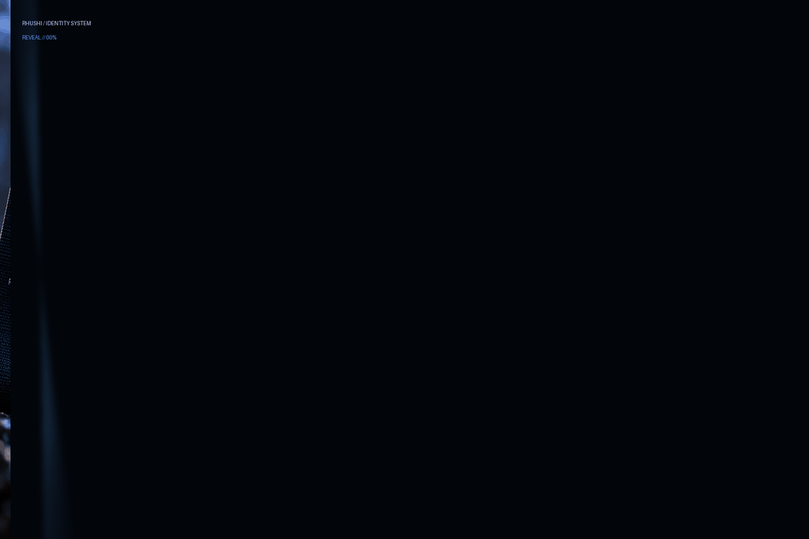
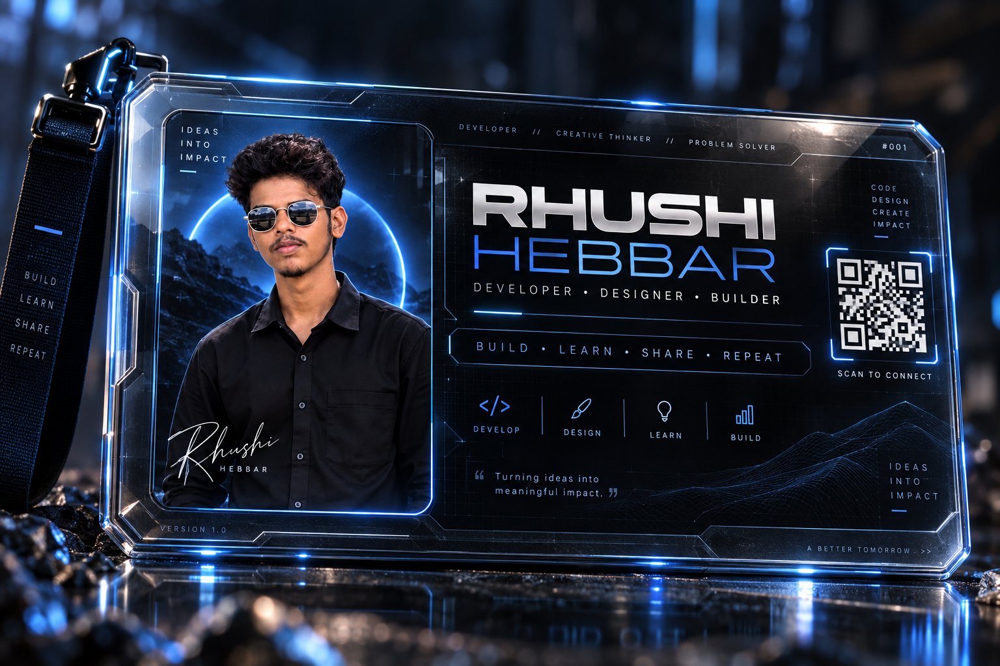
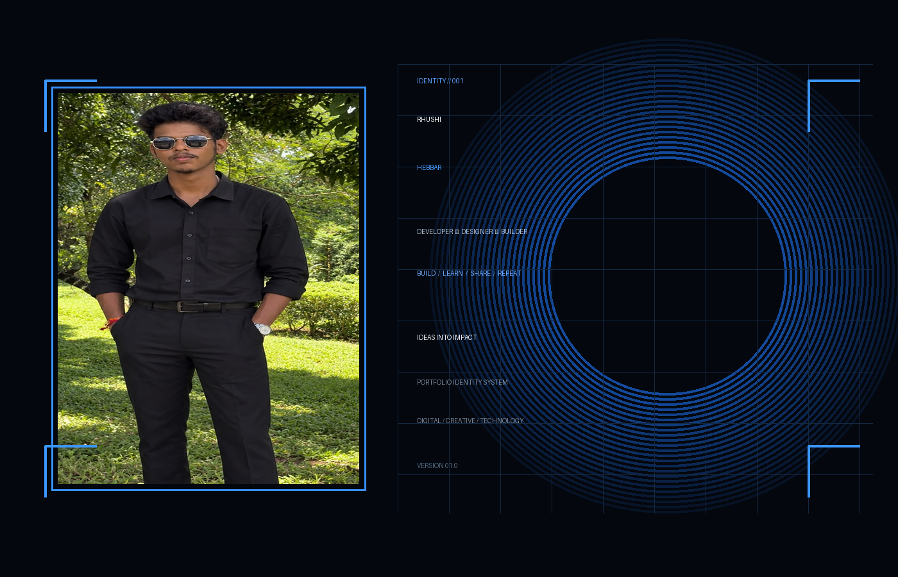

<div align="center">

# ⚡ RHUSHI HEBBAR — IDENTITY SYSTEM

### `DEVELOPER  •  DESIGNER  •  BUILDER`



<br/>

**IDEAS INTO IMPACT**  
`BUILD` · `LEARN` · `SHARE` · `REPEAT`

</div>

---

## ◈ SYSTEM ONLINE

This README is designed as a **cinematic identity experience**, not a conventional profile page.

The visual language combines:

- **3D glass + machined-metal identity card**
- **Electric-blue holographic lighting**
- **Dark cinematic contrast**
- **HUD / sci-fi interface geometry**
- **Portrait-led personal branding**
- **Progressive visual reveals**
- **Responsive GitHub-native layout**
- **Minimal typography with high-impact spacing**

> **Design principle:** make the visitor discover the identity layer by layer instead of dropping every detail at once.

---

## ◉ IDENTITY CARD

<div align="center">

</div>

### CARD ARCHITECTURE

| Layer | Purpose |
|---|---|
| `PORTRAIT` | Human identity / visual anchor |
| `NAMEPLATE` | Rhushi Hebbar identity lockup |
| `HUD` | Technical / futuristic interface language |
| `BLUE RIM` | Signature visual accent |
| `MICROTEXT` | Premium detail and depth |
| `QR ZONE` | Connection / portfolio entry point |
| `SIGNATURE` | Personal mark |
| `VERSION` | Product-like identity-system feel |

---

## ◇ CLEAN ID PANEL

<div align="center">

</div>

---

## ▣ ABOUT THE BUILDER

**Rhushi Hebbar** is presented here through a visual identity system built around one idea:

> **Turn ideas into meaningful digital impact.**

The README intentionally treats a GitHub profile like a **digital product launch screen** — visual first, information second.

---

## ◌ CORE SIGNAL

```text
01  BUILD
02  LEARN
03  SHARE
04  REPEAT
```

```text
SYSTEM:
    CREATIVE ENGINEERING
    DIGITAL DESIGN
    SOFTWARE
    VISUAL STORYTELLING

MODE:
    ALWAYS BUILDING
```

---

## ⟡ VISUAL LANGUAGE

```text
┌─────────────────────────────────────────────────────┐
│  IDENTITY                                           │
│                                                     │
│  HUMAN PORTRAIT       +       DIGITAL SYSTEM       │
│                                                     │
│  DARK MATERIAL        +       ELECTRIC BLUE        │
│                                                     │
│  CINEMATIC DEPTH      +       HUD PRECISION         │
└─────────────────────────────────────────────────────┘
```

### Signature palette

`#02050A` · `#0A1220` · `#1E7BFF` · `#8EC5FF` · `#F4F7FB`

---

## ⌁ THE README EXPERIENCE

The page is structured as a cinematic sequence:

**01 — SIGNAL**  
The visitor sees the animated identity reveal.

**02 — IDENTITY**  
The futuristic ID card establishes the personal brand.

**03 — SYSTEM**  
Technical capabilities and working philosophy appear as interface modules.

**04 — WORK**  
Projects, experiments and builds become the main content layer.

**05 — CONNECT**  
Social links, contact and portfolio become the final navigation layer.

This structure keeps the first viewport **visual, premium and uncluttered** while still allowing the complete profile to live underneath.

---

## ⊙ PROJECT MODULE

Use this pattern for future projects:

```text
╭──────────────────────────────────────────────╮
│ PROJECT / 001                                │
│                                              │
│ NAME                                         │
│ short one-line description                  │
│                                              │
│ STACK: Python · Flask · SQL · AI             │
│ STATUS: ACTIVE                               │
│                                              │
│ [ VIEW PROJECT ]   [ SOURCE ]                │
╰──────────────────────────────────────────────╯
```

---

## ◈ DESIGN RULES

- Keep the **first screen cinematic**.
- Use **one dominant accent color**.
- Prefer **depth, glow and spacing** over visual clutter.
- Reveal technical information progressively.
- Keep every section readable on mobile.
- Use image assets instead of fragile CSS/JavaScript tricks inside GitHub Markdown.
- Treat every project as a **product module**, not a plain list item.

---

## ⚙️ ASSET MAP

```text
rhushi-futuristic-readme-pack/
│
├── README.md
│
└── assets/
    ├── portrait-original.jpg
    ├── id-card-cinematic.png
    ├── id-card-clean-panel.png
    └── cinematic-id-reveal.gif
```

---

## ✦ NEXT-LEVEL EXTENSION

For an even more cinematic profile, add:

```text
01  animated boot screen
02  holographic skill matrix
03  3D project cards
04  contribution heatmap framed as a HUD
05  animated timeline
06  terminal-style command center
07  achievements as collectible modules
08  final contact / transmission screen
```

The result becomes less like a README and more like a **personal digital command center**.

---

<div align="center">

### `END OF TRANSMISSION`

**RHUSHI HEBBAR**

`BUILD • LEARN • SHARE • REPEAT`

</div>
